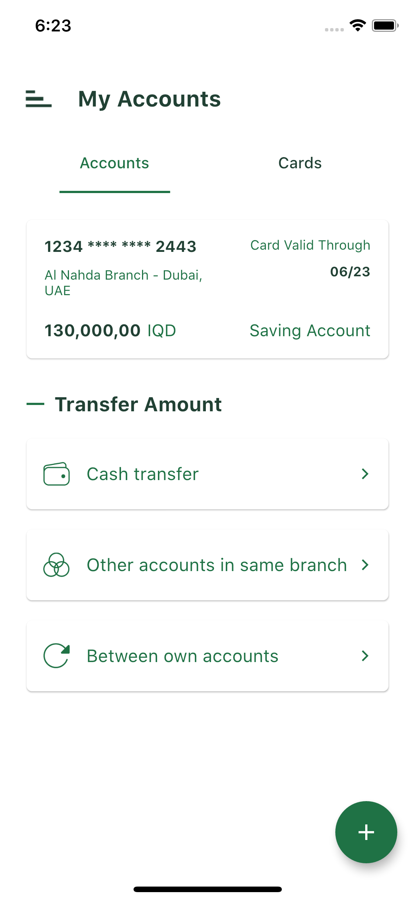
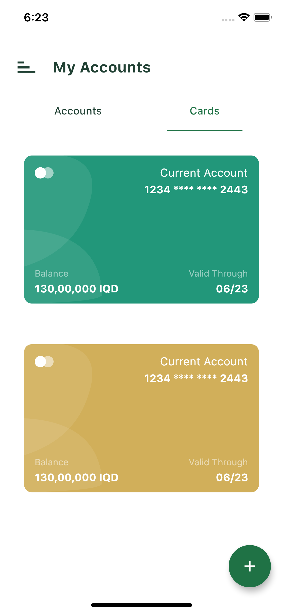

# 🎨 Flutter Custom Card UI with CustomClipper

This project demonstrates how to create a custom card UI in Flutter using the `CustomClipper` class. It showcases how to implement custom curves and shapes to enhance the visual appeal of your Flutter applications.

## 📸 Screenshots

<p float="left">
  
  
</p>

## 🛠️ Features

- Custom card design with unique curves
- Implementation of `CustomClipper` for custom shapes
- Responsive UI suitable for various screen sizes

## 📂 Project Structure

- `main.dart`: Entry point of the application.
- `custom_card.dart`: Contains the custom card widget utilizing `CustomClipper`.
- `assets/`: Directory containing image assets used in the project.

## 🚀 Getting Started

### Prerequisites

- Flutter SDK installed
- Compatible IDE (e.g., Android Studio, VS Code)

### Installation

1. Clone the repository:

   ```bash
   git clone https://github.com/iqbaltld/dev_task.git
   ```

2. Navigate to the project directory:

   ```bash
   cd dev_task
   ```

3. Get the required packages:

   ```bash
   flutter pub get
   ```

4. Run the application:

   ```bash
   flutter run
   ```

## 🧠 Understanding CustomClipper

The `CustomClipper` class in Flutter allows developers to create custom shapes by defining a clipping path. By extending `CustomClipper<Path>`, you can override the `getClip` method to define the desired shape and the `shouldReclip` method to determine when the clip should be updated.

**Example:**

```dart
class MyCustomClipper extends CustomClipper<Path> {
  @override
  Path getClip(Size size) {
    var path = Path();
    // Define your custom path here
    return path;
  }

  @override
  bool shouldReclip(CustomClipper<Path> oldClipper) => false;
}
```

For more information on `CustomClipper`, refer to the official Flutter documentation: [CustomClipper](https://api.flutter.dev/flutter/rendering/CustomClipper-class.html)

## 📱 APK Download

You can download the APK file for this project from the repository: [dev_task.apk](dev_task.apk)

## 📧 Contact

For any inquiries or feedback, feel free to reach out:

- **Name**: Muhammed Iqbal
- **LinkedIn**: [linkedin.com/in/iqbaltld](https://linkedin.com/in/iqbaltld)

